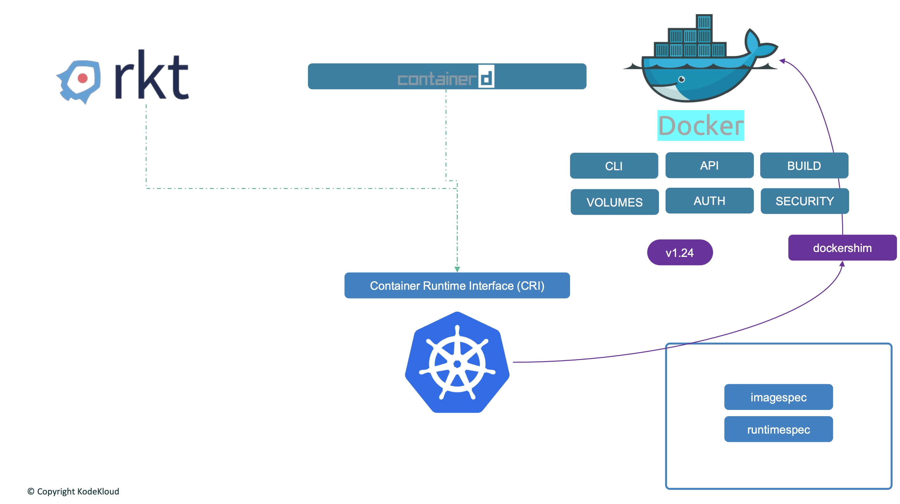
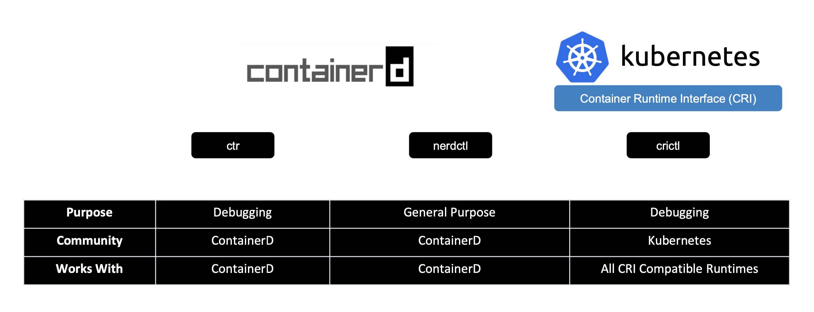

쿠버네티스를 공부하거나 쿠버네티스를 관리하면 Docker와 ContainerD 관련해서 많이 언급되는 것을 볼 수 있다.

컨테이너의 역사를 돌아보면 제일 처음에는 Docker와 rkt 등이 존재하였지만, Docker의 사용자 경험이 가장 뛰어났고 이에 따라 가장 독점적인 컨테이너 도구가 되었다.

그 후, 쿠버네티스가 Docker의 오케스트레이션을 맡았다. 즉, 쿠버네티스는 Docker를 관리하고 지휘하기 위해서 만들어졌다. 따라서 그 당시에는 쿠버네티스는 오직 Docker를 관리하는 툴이었고 다른 컨테이너 솔루션은 지원하지 않았다.

그러다가 쿠버네티스는 컨테이너 오케스트레이션 기술로서 인기가 많아졌고, rkt과 같은 다른 컨테이너 런타임도 원하게 됐다. 그래서 쿠버네티스 사용자는 Docker 이외의 컨테이너 런타임을 사용하려면 다른 무언가가 필요했다. 결국 쿠버네티스는 **CRI(Container Runtime Interface)** 라는 인터페이스를 도입하였다.

CRI는 어떤 공급업체든 쿠버네티스의 컨테이너 런타임으로 동작할 수 있도록 해준다. 하지만 OCI 표준을 준수해야만 가능하다. 

OCI는 Open Container Initiative의 약자로 imagespec과 runtimespec으로 구성되어있다. imagespec은 이미지를 어떻게 만들어야 하는지 설명한 것이다.

이에 따라서 CRI에 맞는 Container Runtime을 만들면 어떤 것이든 쿠버네티스의 컨테이너 런타임으로 동작할 수 있다.

하지만 Docker는 CRI 표준을 지원하려고 만든 것이 아니다. Docker는 CRI가 나오기 훨씬 전에 만들어졌고, Docker는 여전히 주요 컨테이너 도구였기 때문에 쿠버네티스는 Docker를 계속 지원해야만 했다. 그래서 쿠버네티스는 **dockershim**을 도입했다. dockershim은 **컨테이너 런타임 밖에서 Docker를 지원하는 임시방편**으로 말이다.

Docker는 여러 도구들로 구성되어있다. 그 중에 ContainerD는 CRI와 호환이 가능하고 다른 런타임처럼 쿠버네티스와 직접적으로 작업할 수 있다. 따라서 ContainerD는 Docker와는 별도로 런타임으로 사용될 수 있다.



위와 같이 ContainerD는 Docker와 별도로 런타임으로 사용되어지고, 쿠버네티스는 Docker를 직접적으로 지원했다. 하지만 dockershim을 유지하기 위한 불필요한 노력으로 문제가 더 커졌다. 따라서 version 1.24에서 dockershim을 완전히 제거 결정을 하였고 이에 따라 Docker 지원이 끊겼다.

요약하자면 Docker가 만든 모든 이미지는 표준을 따라서 계속 ContainerD와 작업하고, dockershim을 통합 Docker와의 직접적인 지원이 끊긴 것이다.

Docker를 설치하지 않고 ContainerD를 자체 설치할 수 있다. Docker의 세부적인 기능들이 필요하지 않다면 ContainerD만 설치해도 괜찮다.

ContainerD는 컨테이너를 실행하기 위해서 몇몇 CLI 명령어를 지원한다. 바로 ctr 이라는 CLI 명령어 이다.

```shell
ctr images pull docker.io/library/redis:alpine
```

```shell
ctr run docker.io/library/redis:alpine redis
```

ctr 명령어는 많은 기능들을 제공하지 않기 때문에 더 나은 대안으로 nerdctl 명령도 존재한다. 이 명령어는 ContainerD를 위한 Docker 명령어와 비슷한 명령어를 지원한다. nerdctl 은 docker-compose도 지원한다.

```shell
nerdctl run --name redis redis:alpine
```

```shell
nerdctl run --name webserver -p 80:80 -d nginx
```

ctr과 nerdctl은 ContainerD를 위한 명령어 였다면 crictl 이라는 CRI를 위한 명령어도 존재한다. 이 명령어는 보통 디버깅 용도로 사용되는 명령어이다. 또한 crictl 명령어는 kubelet과 잘 어울린다. 만약 crictl를 디버깅 용도로 사용하지 않고 컨테이너를 만드는 명령어를 사용한다면 kubelet은 자신이 만든 컨테이너가 아니기 때문에 crictl로 만들어진 컨테이너를 삭제할 것이다.

```shell
crictl pull busybox
```

```shell
crictl images
```

```shell
crictl ps -a
```

```shell
crictl exec -it ${CONTAINER_ID} ls
```

```shell
crictl logs ${CONTAINER_ID}
```

**pod 목록을 열거 가능**

```shell
crictl pods
```

각각의 명령어들의 목적을 요약하자면 다음과 같다.

- ctr
	- ContainerD를 위한 디버깅용 CLI 명령어이다.
	- 명령어가 다양하지 않기 때문에 디버깅용으로 보통 쓰인다.
- nerdctl
	- ContainerD를 위한 범용 CLI 명령어이다.
	- ctr보다 더 다양한 명령어가 존재하기 때문에 범용으로 쓰인다.
- crictl
	- CRI를 위한 디버깅용 CLI 명령어이다.
	- crictl로 자원을 생성, 수정, 삭제하면 kubelet이 이를 감지하고 자신이 한 행동이 아니기 때문에 되돌려놓기 때문에 보통 디버깅용으로 사용된다. kubelet이 다운되었을 때 대신해서 장애 원인을 분석하기 위한 디버깅용으로 많이 사용된다.
	- CRI와 호환되는 모든 런타임에 사용이 가능하다.


