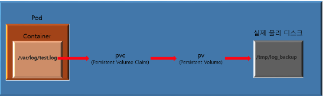

# Kubernetes Volumes

## 볼륨의 필요성

컨테이너 특성상 어떤 문제가 발생하여 컨테이너가 삭제된다면 데이터도 같이 삭제된다. 특정 파일의 경우 삭제되더라도 상관이 없겠지만, 로그 파일 또는 데이터베이스 데이터의 경우 실시간으로 생성되면 데이터가 사라지면 큰 장애가 발생한다.

이러한 이유로 컨테이너를 사용중일 때 중요한 데이터가 있다면 볼륨을 사용하여 데이터를 보관해줘야 한다.

## emptyDir

`emptyDir`은 **Pod이 사라지면 볼륨도 같이 삭제되는 임시 볼륨**의 성격을 가지고 있고 Pod이 실행되는 디스크의 공간에 볼륨을 마운트하게 된다.

위의 이유로 Life Cycle이 **컨테이너가 아닌 Pod 단위**로 되어있어서 **컨테이너가 어떠한 문제로 삭제되어도 Pod은 실행중이므로 데이터는 emptyDir에 의해 보관**되며 Pod이 삭제되는 순간 emptyDir로 보관중이던 모든 데이터는 삭제된다.

```yaml
apiVersion: v1
kind: Pod
metadata:
  name: emptydir-pod
spec:
  containers:
  - name: nginx
    image: nginx
    volumeMounts:
    - mountPath: /emptydir
      name: emptydir-volume
  volumes:
  - name: emptydir-volume
    emptyDir: {}
```

- spec.containers.volumeMounts.mountPath: 실행될 컨테이너 안에 마운트할 경로이다. 컨테이너 안에 해당 디렉토리가 없더라도 자동으로 생성해준다.
- spec.containers.volumeMounts.name: 마운트할 볼륨의 이름
- spec.volumes: 위의 작성한 볼륨의 이름을 지정

## hostPath

`hostPath`는 **노드의 디스크에 볼륨을 생성**하여 Pod이 삭제되더라도 볼륨에 있던 데이터는 유지된다.

```yaml
apiVersion: v1
kind: Pod
metadata:
  name: hostpath-pod
spec:
  containers:
  - name: hostpath-pod
    image: nginx
    volumeMounts:
    - mountPath: /hostpath
      name: hostpath-volume
  volumes:
  - name: hostpath-volume
    hostPath:
      path: /tmp/hostpath 
      type: Directory
```

- spec.containers.volumeMounts.mountPath: 실행된 컨테이너 안에 마운트할 경로
- spec.containers.volumeMounts.name: 마운트할 볼륨의 이름
- spec.volumes.name: 위에 작성한 hostpath-volume을 사용하도록 지정해준다.
- spec.volumes.hostPath: 노드에 마운트할 경로를 지정해주고, 해당 경로는 Directory라는 것을 명시. 해당 디렉토리는 노드에 생성되어 있어야 하고, DirectoryOrCreate를 사용할 경우 디렉토리가 존재하지 않으면 생성해준다.

## PV(Persistent Volume) & PVC(Persistent Volume Claim)

PV는 관리자에 의해 생성된 볼륨을 뜻하고, PVC는 사용자가 볼륨을 사용하기 위해 PV에 요청을 하게된다. 컨테이너의 /var/log/test.log 파일을 특정 스토리지의 /tmp/log_backup 경로에 PVC와 PV 설정을 하면 아래와 같은 형태가 될 수 있다.



### PV와 PVC의 LifeCycle

PV와 PVC는 크게 4개 정도의 LifeCycle을 가진다.

1. 프로비저닝(Provisioning)

**정적(static) 또는 동적(dynamic)의 PV를 생성하는 단계**이며 적어도 지금 작성하는 LifeCycle인 프로비저닝에서는 PV 생성이라는 단어를 프로비저닝이라고 불러도 모두 같은 의미가 된다. PV 생성(프로비저닝)이 정상적으로 성공하면 Available 상태가 된다.

정적 프로비저닝은 매니패스트 파일 등을 통해 **특정 용량을 가진 PV를 미리 생성**해두고, **요청이 있을 시 미리 생성한 PV를 할당**하여 사용하게 된다.

동적 프로비저닝은 정적과는 다르게 **사용자가 요청할 때 PV를 생성하여 할당**하고, 사용자는 **원하는 만큼의 용량을 생성해서 자유롭게 사용**할 수 있다.

2. 바인딩(Binding)

**PV를 PVC에 연결시키는 단계**이다. PVC는 사용자가 요청하는 볼륨을 PV에 요청하고 PV는 그에 맞는 볼륨이 있으면 할당해주게 된다. 만약 PVC가 요청하는 볼륨이 PV에 없다면 해당 요청은 무한정 남아있게 되고, PVC가 요청하는 볼륨이 PV에 생성되면 그 요청은 받아들여져 할당해주게 된다.

PVC와 PV는 ClaimRef를 사용하는 **1:1 관계**이며 **바인딩이 정상적으로 완료될 경우 bound 상태가 된다.**

3. 사용(using)

**Pod은 PVC를 볼륨으로 사용하는 상태**이다. 클러스터는 PVC를 확인하여 바인딩된 PV를 찾고 해당 볼륨을 Pod에서 사용할 수 있도록 해준다.

만약 Pod이 사용중인 PVC를 삭제하려고 하면 Storage Object in Use Protection에 의해 삭제되지 않습니다. 만약 삭제 요청을 하였다면 Pod이 PVC를 사용하지 않을떄까지 삭제 요청을 연기된다.

4. 회수(Reclaiming)

PV는 기존에 사용했던 PVC가 아니더라도 다른 PVC로 재활용이 가능하다. 때문에 사용이 종료된 PVC를 삭제할 때, 사용했던 PV의 데이터를 어떻게 처리할지에 대한 설정을 하게된다.

- Retain: PV의 **데이터를 그대로 보존**한다.
- Recycle: **재사용하게될 경우 기존의 PV 데이터들을 모두 삭제 후 재사용** 한다.
- Delete: **사용이 종료되면 해당 볼륨을 삭제**한다.

